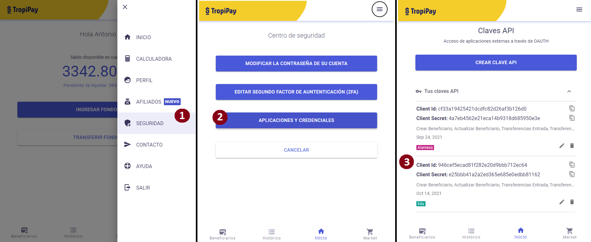

# OAuth code
Example for oauth2 integration based on authorization code flow

## Install 
- git clone https://github.com/tropipay/demo-oauth-code-nodejs.git
- cd ./demo-oauth-code-nodejs
- npm install 
- npm start 

## Requirements 
In order to use this demo, it is necessary to create a credential app previously, see the sequence of screenshots shown below.
